# Chat App — Phase 1 Architecture (Complete Guide)

Requirements covered by every approach below: **login, 1:1 + group chat, attachments, typing indicators, blocking.**
Each approach is designed so Phase 2 (1:1 and group voice/video calls) can be _added_, not bolted on with a rewrite.

> **Note for Backend Beginners:** Backend architecture is fundamentally about trade-offs between **complexity**, **cost**, and **control**. There is no "perfect" architecture, only the one that best fits your current scale and learning goals. The sections below include foundational context to help you understand _why_ certain technologies are chosen.

---

# Part 1: Backend / Infrastructure Architecture Approaches

## Approach 1: Single-Server Monolith (Self-Managed)

### 📘 Background & Tech Stack Basics

A monolith is a single deployable unit where all application logic (authentication, messaging, file handling) lives in one codebase and runs in one process. This is how most web applications start because it mirrors how developers think about code: sequentially and cohesively.

One always-on Node.js process holds everything: REST API + WebSocket server, in-memory connection map, talking to managed AWS storage. Simplest mental model — everything fits in your head at once.

- **Runtime:** Node.js (JavaScript/TypeScript) or Go. Node is ideal for chat due to its non-blocking I/O model, which handles thousands of concurrent WebSocket connections efficiently without spawning a new thread per user.
- **Real-Time Layer:** Socket.IO. A library built on top of WebSockets that adds automatic reconnection, room broadcasting, and fallbacks to HTTP long-polling if WebSockets fail.
- **Database:** PostgreSQL (Relational). Best for structured data like users, groups, and blocklists where relationships (foreign keys) guarantee data integrity.
- **Cache/PubSub:** Redis. An in-memory store used for ephemeral data (typing indicators, online presence) and as a message bus to broadcast events across the server.
- **Storage:** AWS S3. Object storage for attachments. Never store binary files in your database; use presigned URLs to let clients upload directly to S3.

### 🏗️ System Architecture

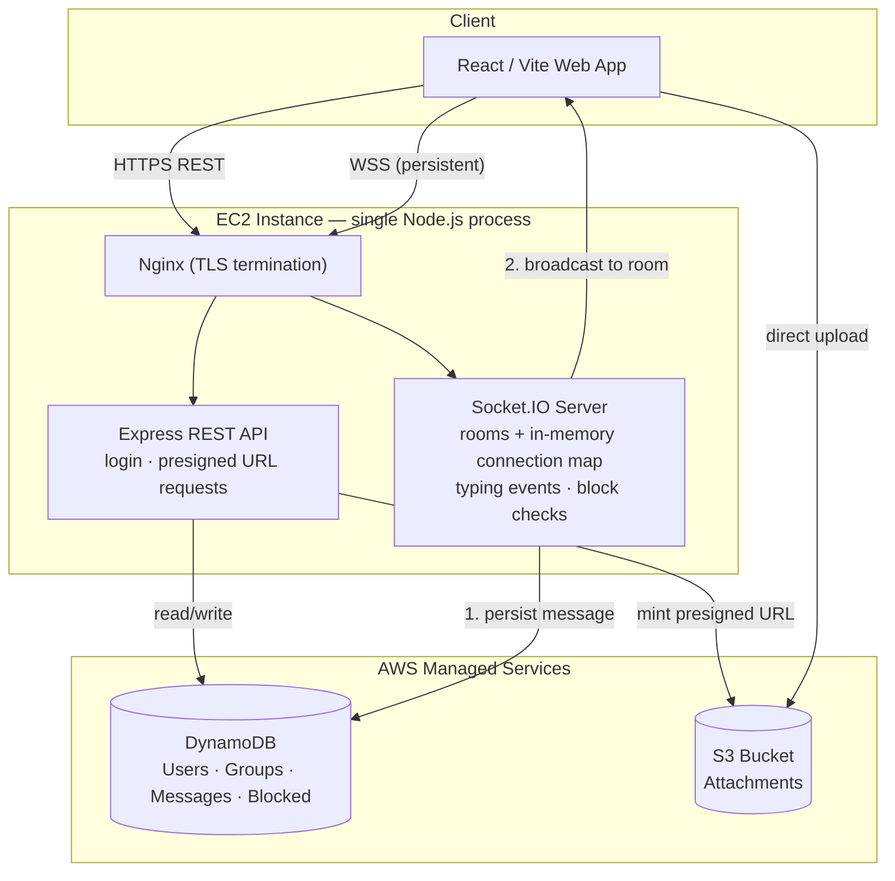

### 📡 Message Flow (Why Persist-Before-Broadcast Matters)

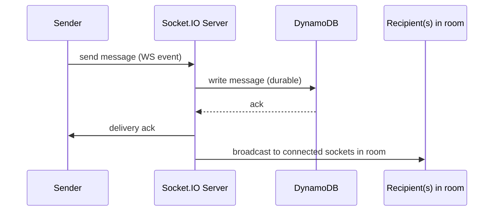

Persisting first guarantees the message survives a server crash even if broadcast never completes — the sender gets a clear failure signal instead of a message that _looked_ sent but wasn't saved.

### 🔧 Backend Architecture Details

#### Data Modeling & Database Design

The monolith's data layer is straightforward — a single process connects to a single database. Two viable approaches:

| Option                 | When to Use                                                                                                                                                    | Key Consideration                                                                                                                                                                                                |
| :--------------------- | :------------------------------------------------------------------------------------------------------------------------------------------------------------- | :--------------------------------------------------------------------------------------------------------------------------------------------------------------------------------------------------------------- |
| **PostgreSQL + Redis** | When data is naturally relational (groups ↔ members, users ↔ blocks). SQL JOINs simplify queries like "get all members of group X who haven't blocked user Y." | Redis handles ephemeral state (typing, presence, pub/sub) while Postgres handles durable data. Use connection pooling (e.g., `pg-pool`) since the single process creates a known, bounded number of connections. |
| **DynamoDB**           | When you want zero DB ops (no vacuuming, no connection limits, no failover config). Pay-per-request pricing is free-tier friendly.                             | Requires **single-table design** with composite keys (`PK=USER#id / SK=PROFILE`, `PK=CONV#id / SK=MSG#timestamp`). No JOINs — denormalize aggressively or use batch operations.                                  |
| **Cassandra/ScyllaDB** | When message volume is the bottleneck (millions of writes/sec). Optimized for rapid, append-heavy sequential writes at massive horizontal scale.               | Meaningful operational overhead (cluster management, tuning). Discord migrated to this specifically for write throughput. Treat as "read about it now, reach for it later."                                      |

**Schema example (PostgreSQL):**

```sql
-- Users table
CREATE TABLE users (
  id UUID PRIMARY KEY DEFAULT gen_random_uuid(),
  username VARCHAR(50) UNIQUE NOT NULL,
  email VARCHAR(255) UNIQUE NOT NULL,
  password_hash VARCHAR(255) NOT NULL,
  avatar_url TEXT,
  last_seen TIMESTAMPTZ DEFAULT NOW(),
  created_at TIMESTAMPTZ DEFAULT NOW()
);

-- Conversations (1:1 and group)
CREATE TABLE conversations (
  id UUID PRIMARY KEY DEFAULT gen_random_uuid(),
  type VARCHAR(10) CHECK (type IN ('direct', 'group')) NOT NULL,
  name VARCHAR(100),  -- NULL for direct chats
  created_by UUID REFERENCES users(id),
  created_at TIMESTAMPTZ DEFAULT NOW()
);

-- Conversation membership (with role for groups)
CREATE TABLE conversation_members (
  conversation_id UUID REFERENCES conversations(id) ON DELETE CASCADE,
  user_id UUID REFERENCES users(id) ON DELETE CASCADE,
  role VARCHAR(10) DEFAULT 'member' CHECK (role IN ('admin', 'member')),
  joined_at TIMESTAMPTZ DEFAULT NOW(),
  PRIMARY KEY (conversation_id, user_id)
);

-- Messages (with status tracking)
CREATE TABLE messages (
  id UUID PRIMARY KEY DEFAULT gen_random_uuid(),
  conversation_id UUID REFERENCES conversations(id) ON DELETE CASCADE,
  sender_id UUID REFERENCES users(id),
  body TEXT,
  attachment_url TEXT,
  attachment_type VARCHAR(20),  -- 'image', 'video', 'file'
  status VARCHAR(10) DEFAULT 'sent' CHECK (status IN ('sent', 'delivered', 'read')),
  created_at TIMESTAMPTZ DEFAULT NOW()
);
CREATE INDEX idx_messages_conv_time ON messages(conversation_id, created_at DESC);

-- Block list
CREATE TABLE blocks (
  blocker_id UUID REFERENCES users(id) ON DELETE CASCADE,
  blocked_id UUID REFERENCES users(id) ON DELETE CASCADE,
  created_at TIMESTAMPTZ DEFAULT NOW(),
  PRIMARY KEY (blocker_id, blocked_id)
);
```

#### API Design & Endpoints

REST handles all non-realtime operations. WebSocket handles live events.

**REST endpoints:**

| Method   | Route                             | Purpose                                      |
| :------- | :-------------------------------- | :------------------------------------------- |
| `POST`   | `/api/auth/register`              | Create account (hash password with bcrypt)   |
| `POST`   | `/api/auth/login`                 | Issue JWT access + refresh token pair        |
| `POST`   | `/api/auth/refresh`               | Rotate refresh token                         |
| `GET`    | `/api/conversations`              | List user's conversations (paginated)        |
| `POST`   | `/api/conversations`              | Create group / initiate DM                   |
| `GET`    | `/api/conversations/:id/messages` | Paginated history (cursor-based, not offset) |
| `POST`   | `/api/upload/presign`             | Generate S3 presigned PUT URL                |
| `POST`   | `/api/users/:id/block`            | Add to blocklist                             |
| `DELETE` | `/api/users/:id/block`            | Remove from blocklist                        |

**WebSocket events:**

| Event             | Direction       | Payload                                            |
| :---------------- | :-------------- | :------------------------------------------------- |
| `message:send`    | Client → Server | `{ conversationId, body, tempId, attachmentUrl? }` |
| `message:new`     | Server → Client | `{ message, conversationId }`                      |
| `message:ack`     | Server → Client | `{ tempId, realId, status }`                       |
| `typing:start`    | Bidirectional   | `{ conversationId, userId }`                       |
| `typing:stop`     | Bidirectional   | `{ conversationId, userId }`                       |
| `presence:update` | Server → Client | `{ userId, status, lastSeen }`                     |

#### Authentication Flow

```
Client                          Server
  │                                │
  ├──POST /auth/login──────────────►│  Validate credentials
  │                                │  Hash compare (bcrypt)
  │◄──{ accessToken, refreshToken }│  Sign JWT (15min access, 7d refresh)
  │                                │
  ├──WS connect + accessToken──────►│  Verify JWT in Socket.IO middleware
  │                                │  Add to connection map: userId → socketId
  │◄──connection:established───────│
  │                                │
  ├──(token expires)               │
  ├──POST /auth/refresh────────────►│  Verify refresh token
  │◄──{ newAccessToken }───────────│  Rotate refresh token (one-time use)
```

**Key decisions:** Store refresh tokens in `httpOnly` cookies (not localStorage — XSS-safe). Access tokens go in memory (Zustand/Redux store) and are attached to WebSocket handshake as a query param or auth header.

#### Connection Management

The in-memory connection map is the heart of the monolith's real-time capability:

```javascript
// Connection map: userId → Set<socketId> (user may have multiple tabs)
const connections = new Map();

io.use(async (socket, next) => {
  const token = socket.handshake.auth.token;
  try {
    const payload = jwt.verify(token, SECRET);
    socket.userId = payload.userId;
    next();
  } catch (err) {
    next(new Error('Authentication failed'));
  }
});

io.on('connection', (socket) => {
  // Track connection
  if (!connections.has(socket.userId)) {
    connections.set(socket.userId, new Set());
  }
  connections.get(socket.userId).add(socket.id);

  // Join all conversation rooms
  const userConversations = await db.getConversationsForUser(socket.userId);
  userConversations.forEach(conv => socket.join(`conv:${conv.id}`));

  socket.on('disconnect', () => {
    connections.get(socket.userId)?.delete(socket.id);
    if (connections.get(socket.userId)?.size === 0) {
      connections.delete(socket.userId);
      // Broadcast offline status
    }
  });
});
```

#### Deployment & DevOps

| Component       | Tool                                   | Why                                                              |
| :-------------- | :------------------------------------- | :--------------------------------------------------------------- |
| Process manager | **PM2**                                | Auto-restart on crash, log rotation, cluster mode for multi-core |
| Reverse proxy   | **Nginx**                              | TLS termination, WebSocket upgrade handling, static file serving |
| Deployment      | **GitHub Actions → SSH → PM2 restart** | Simplest CI/CD. Pull → install → restart.                        |
| Monitoring      | **PM2 metrics + CloudWatch agent**     | CPU, memory, connection count. Free-tier sufficient.             |
| SSL             | **Let's Encrypt (Certbot)**            | Free TLS certs, auto-renewal via cron                            |

### ⚖️ Detailed Pros & Cons

| Category    | Details                                                                                                                                                                                                                                                                                                                                                                                                                                                                                                                                                                                                                                                                                                         |
| :---------- | :-------------------------------------------------------------------------------------------------------------------------------------------------------------------------------------------------------------------------------------------------------------------------------------------------------------------------------------------------------------------------------------------------------------------------------------------------------------------------------------------------------------------------------------------------------------------------------------------------------------------------------------------------------------------------------------------------------------- |
| ✅ **Pros** | • **Mental Model Simplicity:** All code is in one repo. Debugging requires reading one log stream and setting breakpoints in one process.<br>• **Zero Network Overhead Between Services:** Auth checking a message doesn't require an HTTP call to another service; it's just a function call.<br>• **Transaction Safety:** Postgres ACID transactions ensure that creating a group and adding members happens atomically. No distributed transaction complexity.<br>• **Free-Tier Friendly:** One `t4g.micro` EC2 instance (750 hrs/mo free) handles everything for dev-scale traffic.<br>• **Phase 2 Ready:** The same Socket.IO server becomes your WebRTC signaling server with zero architectural changes. |
| ❌ **Cons** | • **Single Point of Failure:** If the Node process crashes or the EC2 instance dies, _everything_ goes down (chat, auth, uploads).<br>• **Vertical Scaling Only:** When CPU/RAM limits are hit, you must upgrade to a larger instance rather than adding more servers easily.<br>• **Deployment Coupling:** Changing the typing indicator logic requires redeploying the entire auth + message + media stack.<br>• **Memory Pressure:** Socket.IO keeps connection state in memory. At ~10K+ concurrent connections on a micro instance, you risk OOM kills.<br>• **No Built-In Auto-Scaling:** You must manually configure AWS Auto Scaling Groups and handle sticky sessions for WebSockets.                  |

### Phase 2 Extension

Reuse the same Socket.IO connection as your WebRTC **signaling channel** — add `call:offer` / `call:answer` / `call:ice-candidate` events. For 1:1 calls this is just relaying JSON between two sockets you already track; nothing about the chat server changes. For group calls later, add a standalone SFU (e.g. mediasoup) as a separate service — the chat server just also relays "join this call" signaling to it.

### Complexity Assessment

**Low–Medium.** Ideal for learning core real-time mechanics without infrastructure overhead. One deployable unit, one log stream, one thing to debug.

---

## Approach 2: Fully Serverless (AWS-Native)

### 📘 Background & Tech Stack Basics

Serverless removes server management entirely. Instead of running a persistent process, you define functions that execute _only_ when triggered. AWS manages scaling, patching, and capacity planning. For chat apps, this means using managed WebSocket APIs instead of self-hosting Socket.IO.

- **WebSocket Management:** AWS API Gateway WebSocket API. Maintains persistent connections and routes messages to Lambda functions based on event type (`$connect`, `$disconnect`, `sendMessage`).
- **Compute:** AWS Lambda. Stateless functions that execute business logic. Cold starts (initialization latency) can add 100-500ms delay on first invocation after idle periods.
- **Database:** DynamoDB (NoSQL). Key-value store optimized for millisecond latency at any scale. Requires **single-table design** (composite partition/sort keys) since there are no JOINs.
- **Auth:** AWS Cognito. Managed identity provider that integrates natively with API Gateway authorizers, eliminating JWT signing/hashing code.
- **Storage:** AWS S3 + Presigned URLs (same as Approach 1).

### 🏗️ System Architecture

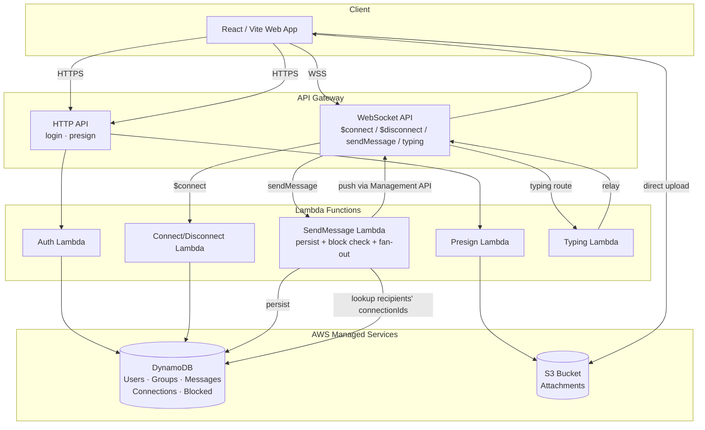

### 🔧 Backend Architecture Details

#### DynamoDB Single-Table Design

The core pattern is encoding entity type and relationships directly into partition/sort key structures:

```
┌─────────────────────┬────────────────────────┬──────────────────────────────┐
│ PK                  │ SK                     │ Attributes                   │
├─────────────────────┼────────────────────────┼──────────────────────────────┤
│ USER#u1             │ PROFILE                │ name, email, avatarUrl       │
│ USER#u1             │ CONV#c1                │ joinedAt, unreadCount        │
│ USER#u1             │ CONV#c2                │ joinedAt, unreadCount        │
│ USER#u1             │ BLOCK#u3               │ createdAt                    │
│ CONV#c1             │ META                   │ type, name, createdBy        │
│ CONV#c1             │ MEMBER#u1              │ role, joinedAt               │
│ CONV#c1             │ MEMBER#u2              │ role, joinedAt               │
│ CONV#c1             │ MSG#2026-07-15T01:00Z  │ senderId, body, status       │
│ CONV#c1             │ MSG#2026-07-15T01:01Z  │ senderId, body, attachmentUrl│
│ CONN#u1             │ ws-abc123              │ connectedAt, ttl             │
└─────────────────────┴────────────────────────┴──────────────────────────────┘

GSI-1 (Inverted Index):
  PK = SK, SK = PK  → Enables queries like "all conversations user u1 is in"
```

**Key access patterns:**

| Access Pattern                 | Query                                                     |
| :----------------------------- | :-------------------------------------------------------- |
| Get user profile               | `PK = USER#u1, SK = PROFILE`                              |
| List user's conversations      | `PK = USER#u1, SK begins_with CONV#`                      |
| Get conversation messages      | `PK = CONV#c1, SK begins_with MSG#` (sorted by timestamp) |
| Check if user blocked          | `PK = USER#u1, SK = BLOCK#u3`                             |
| Find user's active connections | `PK = CONN#u1`                                            |

#### Lambda Function Design

Each Lambda should follow the **single-responsibility** principle:

```
SendMessage Lambda:
  1. Parse & validate incoming JSON payload (JSON Schema)
  2. Check block list: query PK=USER#recipientId, SK=BLOCK#senderId
  3. Persist message: PutItem with PK=CONV#id, SK=MSG#timestamp
  4. Lookup recipient connectionIds: query PK=CONN#recipientId
  5. For each connectionId → call ApiGatewayManagementApi.postToConnection()
  6. If postToConnection fails (410 Gone) → delete stale connection record
  7. If recipient has zero connections → trigger push notification via SNS
```

**Cold start mitigation strategies:**

| Strategy                                  | Trade-off                                                                                       |
| :---------------------------------------- | :---------------------------------------------------------------------------------------------- |
| **Provisioned Concurrency**               | Keeps N instances warm. Costs ~$0.015/GB-hr. Use only for latency-critical paths (SendMessage). |
| **SnapStart (Java) / init phase caching** | Free but limited. In Node.js, move SDK client creation outside the handler.                     |
| **Smaller bundles**                       | Tree-shake aggressively. Use `esbuild` bundler. Each MB of bundle adds ~10ms to cold start.     |
| **ARM64 (Graviton)**                      | 20% cheaper, often faster cold starts than x86. Set `architecture: arm64` in SAM/CDK.           |

#### Auth with Cognito

```
Client                         Cognito              API Gateway
  │                               │                      │
  ├──Sign up (email/pass)────────►│                      │
  │◄──Verification code──────────│                      │
  ├──Confirm sign up─────────────►│                      │
  │                               │                      │
  ├──Sign in─────────────────────►│                      │
  │◄──{ idToken, accessToken, refreshToken }             │
  │                               │                      │
  ├──REST call + idToken─────────────────────────────────►│
  │                               │    Cognito Authorizer │
  │                               │◄───Validate token────│
  │                               │───Claims to Lambda──►│
  │                               │                      │
  ├──WS $connect + token (query param)──────────────────►│
  │                               │    $connect Lambda    │
  │                               │    verifies token     │
  │◄──Connection established─────────────────────────────│
```

#### Infrastructure as Code (IaC)

Use **AWS SAM** (simpler) or **AWS CDK** (more powerful) to define the entire stack:

```yaml
# SAM template excerpt (template.yaml)
Resources:
  WebSocketApi:
    Type: AWS::ApiGatewayV2::Api
    Properties:
      Name: ChatWebSocketAPI
      ProtocolType: WEBSOCKET
      RouteSelectionExpression: "$request.body.action"

  SendMessageFunction:
    Type: AWS::Serverless::Function
    Properties:
      Handler: handlers/sendMessage.handler
      Runtime: nodejs20.x
      Architectures: [arm64]
      MemorySize: 256
      Timeout: 10
      Policies:
        - DynamoDBCrudPolicy:
            TableName: !Ref ChatTable
        - Statement:
            - Effect: Allow
              Action: execute-api:ManageConnections
              Resource: !Sub "arn:aws:execute-api:${AWS::Region}:${AWS::AccountId}:${WebSocketApi}/*"

  ChatTable:
    Type: AWS::DynamoDB::Table
    Properties:
      BillingMode: PAY_PER_REQUEST
      TimeToLiveSpecification:
        AttributeName: ttl
        Enabled: true
```

#### Free-Tier Economics

| Service                 | Free Tier                          | Typical Dev Usage                     | Fits?         |
| :---------------------- | :--------------------------------- | :------------------------------------ | :------------ |
| API Gateway (WebSocket) | Connection-minutes + messages only | Few hundred connections               | ✅ Near $0    |
| Lambda                  | 1M requests/mo + 400K GB-sec       | Chat is idle most of the time         | ✅ Well under |
| DynamoDB                | 25GB storage + 25 WCU / 25 RCU     | Set TTL on old messages to stay under | ✅            |
| Cognito                 | 50K MAU (active users/mo)          | Dev scale                             | ✅            |
| S3                      | 5GB storage, 20K GET, 2K PUT       | Moderate attachment use               | ✅            |

### ⚖️ Detailed Pros & Cons

| Category    | Details                                                                                                                                                                                                                                                                                                                                                                                                                                                                                                                                                                                                                                                                                                                                                                                                                                                                                                                                                  |
| :---------- | :------------------------------------------------------------------------------------------------------------------------------------------------------------------------------------------------------------------------------------------------------------------------------------------------------------------------------------------------------------------------------------------------------------------------------------------------------------------------------------------------------------------------------------------------------------------------------------------------------------------------------------------------------------------------------------------------------------------------------------------------------------------------------------------------------------------------------------------------------------------------------------------------------------------------------------------------------- |
| ✅ **Pros** | • **True Pay-Per-Use:** Offline users cost $0. No idling EC2 charges. Free tier covers 1M Lambda requests/mo + 25GB DynamoDB storage.<br>• **Infinite Horizontal Scaling:** AWS automatically provisions capacity. 10 users or 10,000 users requires zero configuration changes.<br>• **Zero Ops Overhead:** No OS patching, no process managers, no Nginx configs. Focus purely on business logic.<br>• **Built-In High Availability:** Multi-AZ deployment is automatic. No single point of failure at the compute layer.<br>• **Native AWS Integration:** Cognito, S3, SNS, SQS all integrate via IAM roles without credential management.                                                                                                                                                                                                                                                                                                            |
| ❌ **Cons** | • **Cold Start Latency:** First request after idle can take 200-800ms. Unacceptable for typing indicators unless mitigated with provisioned concurrency (costs money).<br>• **Debugging Nightmare:** Distributed traces across Lambda, API GW, DynamoDB require X-Ray setup. No `console.log` to a single terminal.<br>• **Connection State Externalization:** API GW doesn't expose in-memory state. Every message send requires a DynamoDB lookup to map `userId → connectionId`, adding read latency.<br>• **DynamoDB Learning Curve:** Single-table design is fundamentally different from SQL. Poor key design leads to expensive scans or throttling.<br>• **Vendor Lock-In:** Deeply coupled to AWS proprietary APIs. Migrating to another cloud later requires significant rewrite.<br>• **Phase 2 Limitation:** API GW WebSockets have a 1MB message size limit and 30s timeout, which can constrain WebRTC SDP offers for complex group calls. |

### Phase 2 Extension

Signaling rides the same WebSocket API as new routes (`call:offer`, etc.), relayed the same way messages are. For the media path itself you have two real options: self-host an SFU + TURN server on EC2/Fargate (full control, more ops work), or use **AWS Kinesis Video Streams** for the WebRTC media plane (fully managed, less control, but keeps the entire stack serverless including media).

### Complexity Assessment

**Medium.** Less code to write, but significantly harder to debug and reason about due to async/distributed nature. A _different kind_ of complexity than Approach 1.

---

## Approach 3: Hybrid — Realtime on EC2, Async Work on Lambda

### 📘 Background & Tech Stack Basics

This approach recognizes that **not all operations have the same latency requirements**. Chat messages and typing indicators need sub-100ms responses, while push notifications, thumbnail generation, and email delivery can tolerate seconds of delay. The hybrid pattern splits these concerns deliberately.

- **Sync Layer (EC2):** Same Node.js + Socket.IO stack as Approach 1, but _only_ handles latency-sensitive paths: WebSocket connections, message broadcasting, typing events, and block checks.
- **Async Layer (Lambda + SNS/SQS):** Event-triggered functions for non-critical work. Triggered via:
  - **SNS Topics:** Fan-out notifications when a message arrives for an offline user.
  - **S3 Events:** Thumbnail generation when an image is uploaded.
  - **SQS Queues:** Buffered processing for rate-limited external APIs (e.g., email/SMS).
- **Shared Data Layer:** Postgres/DynamoDB + S3, accessed by both layers.

### 🏗️ System Architecture

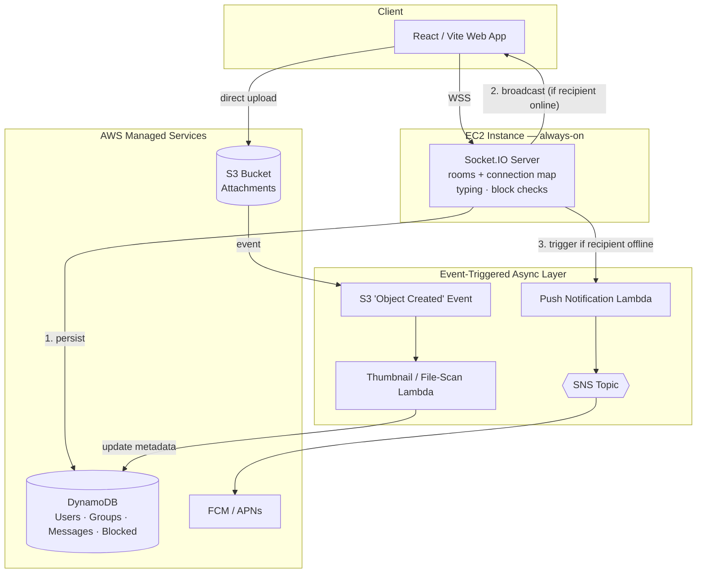

### 🔧 Backend Architecture Details

#### The Sync/Async Boundary — How to Decide

The critical design decision is _where to draw the line_. Use this decision framework:

```
Does the user need an immediate response (<100ms)?
  ├── YES → Keep on EC2 (Socket.IO server)
  │    • Message broadcast to online recipients
  │    • Typing indicator relay
  │    • Block check before send
  │    • Presence status changes
  │    • Read receipt updates
  │
  └── NO → Offload to Lambda (async)
       • Push notifications (FCM/APNs)
       • Thumbnail generation from uploaded images
       • Email notifications for offline users
       • Message search indexing (Elasticsearch/OpenSearch)
       • Attachment virus scanning
       • Usage analytics aggregation
       • Audit log writes
```

#### Event-Driven Wiring (SNS/SQS/S3 Events)

The async layer uses AWS event sources to trigger Lambdas without the EC2 server needing to wait:

```javascript
// On EC2 — after persisting and broadcasting a message
async function handleMessageSend(socket, data) {
  // 1. Persist (sync — must complete)
  const message = await db.saveMessage(data);

  // 2. Broadcast to online room members (sync — low latency)
  socket.to(`conv:${data.conversationId}`).emit("message:new", message);

  // 3. Identify offline recipients and trigger async notification
  const offlineUserIds = getOfflineMembers(data.conversationId, connections);
  if (offlineUserIds.length > 0) {
    // Fire-and-forget — don't await. SNS handles delivery.
    sns
      .publish({
        TopicArn: NOTIFICATION_TOPIC_ARN,
        Message: JSON.stringify({
          type: "new_message",
          conversationId: data.conversationId,
          senderName: socket.userName,
          preview: data.body.substring(0, 100),
          recipientIds: offlineUserIds,
        }),
      })
      .promise()
      .catch((err) => logger.error("SNS publish failed", err));
  }
}
```

#### Lambda Connection Pooling Problem

When Lambda functions access PostgreSQL, each invocation opens a new DB connection. At scale, hundreds of concurrent Lambdas can exhaust Postgres connection limits:

| Solution             | How It Works                                                                                                                    | Trade-off                                                                      |
| :------------------- | :------------------------------------------------------------------------------------------------------------------------------ | :----------------------------------------------------------------------------- |
| **RDS Proxy**        | Managed connection pool between Lambda and RDS. Multiplexes hundreds of Lambda connections into a small pool of DB connections. | ~$0.015/vCPU-hour. Best option for production.                                 |
| **DynamoDB instead** | Eliminates connection pooling entirely — DynamoDB uses HTTP, not persistent connections.                                        | Lose SQL expressiveness. Requires single-table design.                         |
| **Connection reuse** | Set `context.callbackWaitsForEmptyEventLoop = false` and reuse connections across warm invocations.                             | Partial fix only — doesn't help when many cold Lambdas spin up simultaneously. |

#### Dead Letter Queues & Observability

Async tasks _will_ fail silently without proper monitoring:

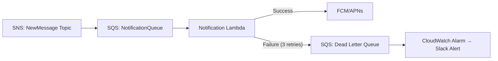

**Key setup:**

- Every SQS queue gets a **Dead Letter Queue (DLQ)** with `maxReceiveCount: 3`
- CloudWatch Alarm triggers when DLQ message count > 0
- DLQ messages are inspected and manually retried or investigated

#### Deployment Strategy

| Component        | Deployment Tool      | Pipeline                                                        |
| :--------------- | :------------------- | :-------------------------------------------------------------- |
| EC2 (Socket.IO)  | PM2 + GitHub Actions | Push → SSH → `git pull` → `npm install` → `pm2 restart`         |
| Lambda functions | AWS SAM / CDK        | Push → `sam build` → `sam deploy` → CloudFormation stack update |
| Shared infra     | Terraform / CDK      | IaC for SNS topics, SQS queues, S3 event configs, IAM roles     |

### ⚖️ Detailed Pros & Cons

| Category    | Details                                                                                                                                                                                                                                                                                                                                                                                                                                                                                                                                                                                                                                                                                                                                                                        |
| :---------- | :----------------------------------------------------------------------------------------------------------------------------------------------------------------------------------------------------------------------------------------------------------------------------------------------------------------------------------------------------------------------------------------------------------------------------------------------------------------------------------------------------------------------------------------------------------------------------------------------------------------------------------------------------------------------------------------------------------------------------------------------------------------------------- |
| ✅ **Pros** | • **Best of Both Worlds:** Low-latency chat with auto-scaling background processing. Heavy tasks never block the WebSocket server.<br>• **Graceful Degradation:** If Lambda fails, chat still works. Notifications are delayed but messages aren't lost.<br>• **Cost Optimization:** EC2 handles steady-state connections cheaply; Lambda handles bursty async work without over-provisioning.<br>• **Natural Phase 2 Extension:** Call recording processing, missed-call notifications, and transcription fit perfectly into the async Lambda layer.<br>• **Incremental Migration Path:** Start with Approach 1, then extract async tasks one-by-one into Lambda. No big-bang rewrite needed.                                                                                 |
| ❌ **Cons** | • **Two Deployment Targets:** Must manage both EC2 (PM2/Nginx) and Lambda (SAM/CDK/Terraform). CI/CD pipeline complexity increases.<br>• **Eventual Consistency Risks:** Async tasks may fail silently. Need dead-letter queues (DLQ) and monitoring to catch dropped notifications.<br>• **Data Access Patterns:** Both EC2 and Lambda need DB access. Managing connection pooling for Lambda (which spawns hundreds of instances) against Postgres requires RDS Proxy or careful pool sizing.<br>• **Testing Complexity:** Integration tests must simulate both sync WebSocket flows and async event triggers.<br>• **Partial Failure Modes:** Message persists but notification Lambda fails → user misses alert. Requires retry logic and observability across boundaries. |

### Phase 2 Extension

Same signaling path as Approach 1 (EC2 socket layer). SFU for group calls becomes a new EC2/Fargate service sitting _next to_ your existing chat server — and you already have the async-Lambda pattern in place for things like call-recording processing or missed-call notifications later.

### Complexity Assessment

**Medium.** Teaches the critical skill of separating sync vs. async concerns, which is foundational for senior backend engineering. Slightly more moving parts than Approach 1, but each piece stays simple on its own.

---

## Approach 4: Microservices with a Message Broker

### 📘 Background & Tech Stack Basics

Microservices decompose the application into independently deployable services organized around **business domains** (auth, messaging, media, presence). They communicate asynchronously via a message broker rather than direct HTTP calls. This is how WhatsApp, Slack, and Discord operate at scale—but it's over-engineering for Phase 1.

- **Message Broker Options:**
  - **Redis Pub/Sub:** Lightest weight. Fire-and-forget. No persistence—if a subscriber is down, the message is lost. Fine for dev scale.
  - **RabbitMQ:** Adds durable queues, acknowledgments, and dead-letter routing. Guarantees delivery at the cost of operational complexity.
  - **Kafka / AWS MSK:** Append-only event log with replay capability. Designed for millions of messages/sec. Massive operational overhead; overkill for portfolio projects.
- **Service Boundaries:** Each service owns its database schema. The Gateway Service holds _no_ business logic—it only maintains WebSocket connections and translates socket events to broker messages.

### 🏗️ System Architecture

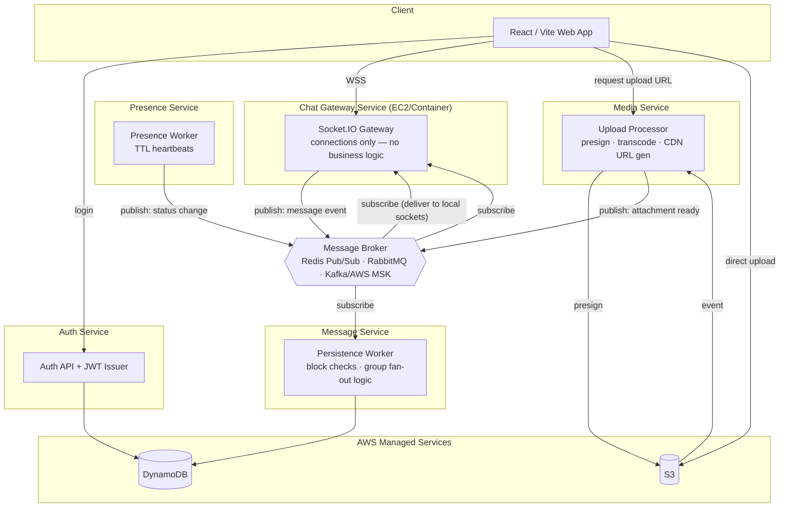

### 🔧 Backend Architecture Details

#### Service Boundary Design

Each service owns its data and exposes behavior through broker events, not shared databases:

| Service      | Owns                                           | Publishes                                                | Subscribes To                                          |
| :----------- | :--------------------------------------------- | :------------------------------------------------------- | :----------------------------------------------------- |
| **Gateway**  | WebSocket connections, room membership         | `user.connected`, `user.disconnected`, `message.inbound` | `message.outbound`, `presence.changed`, `typing.relay` |
| **Auth**     | User credentials, JWT keys, sessions           | `user.created`, `user.updated`                           | —                                                      |
| **Message**  | Message history, delivery status, block checks | `message.outbound`, `message.delivered`                  | `message.inbound`                                      |
| **Presence** | Online/offline status, last-seen timestamps    | `presence.changed`                                       | `user.connected`, `user.disconnected`                  |
| **Media**    | Presigned URLs, thumbnails, CDN config         | `attachment.ready`                                       | S3 `ObjectCreated` events                              |

**The golden rule:** No service ever reads another service's database. All inter-service communication goes through the broker.

#### Message Flow Through the Broker

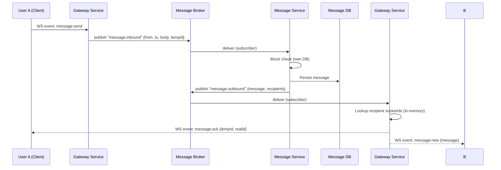

#### Broker Choice Deep Dive

| Broker            | Delivery Guarantee                      | Persistence                             | Ordering         | Operational Overhead                         | When to Use                                      |
| :---------------- | :-------------------------------------- | :-------------------------------------- | :--------------- | :------------------------------------------- | :----------------------------------------------- |
| **Redis Pub/Sub** | At-most-once (fire-and-forget)          | None — missed if subscriber is down     | Per-channel      | Minimal — already using Redis for cache      | Solo project, dev scale, acceptable message loss |
| **RabbitMQ**      | At-least-once (with ack)                | Durable queues survive broker restart   | Per-queue (FIFO) | Moderate — cluster setup, management UI      | Need guaranteed delivery, dead-letter routing    |
| **Kafka / MSK**   | At-least-once, exactly-once (with txns) | Append-only log, configurable retention | Per-partition    | High — ZooKeeper/KRaft, partition management | Need replay, audit logs, millions of msg/sec     |

#### Routing at Scale — Consistent Hashing

Once you have multiple Gateway instances, you need a deterministic way to know which instance a given group/channel's messages should flow through:

```
Gateway instances: [GW-A, GW-B, GW-C]
Hash ring: 0 ────── GW-A ────── GW-B ────── GW-C ────── 0

hash("conv:123") → position 0.35 → routes to GW-B
hash("conv:456") → position 0.71 → routes to GW-C

If GW-B fails:
  hash("conv:123") → next node → GW-C (only conv:123's slice migrates)
```

Slack uses this pattern so lookups stay O(1) and a node failure only disrupts the small slice of channels it owned, rather than requiring a full remap. Not needed at single-instance scale, but essential concept for horizontal scaling.

#### Tenant Isolation (Future)

If you ever want multi-workspace support (like Slack), consider **workspace-based sharding** — dedicating DB partitions/shards per workspace/tenant so one workspace's traffic spike can't degrade another's. Overkill for a single-tenant chat app, but worth having in your back pocket.

#### Service Deployment & Orchestration

| Strategy                         | Tooling                                                | When                                                 |
| :------------------------------- | :----------------------------------------------------- | :--------------------------------------------------- |
| **Docker Compose**               | `docker-compose.yml` with all 5 services + broker + DB | Local development, simplest multi-service setup      |
| **ECS Fargate**                  | Task definitions per service, ALB routing              | Production without Kubernetes complexity             |
| **Kubernetes (EKS)**             | Helm charts, pod autoscaling, service mesh             | Team > 5 engineers, need advanced traffic management |
| **Each service = separate repo** | Mono-repo vs poly-repo decision                        | Poly-repo when teams own services independently      |

### ⚖️ Detailed Pros & Cons

| Category    | Details                                                                                                                                                                                                                                                                                                                                                                                                                                                                                                                                                                                                                                                                                                                                                                                                                                                                                                                                                                                          |
| :---------- | :----------------------------------------------------------------------------------------------------------------------------------------------------------------------------------------------------------------------------------------------------------------------------------------------------------------------------------------------------------------------------------------------------------------------------------------------------------------------------------------------------------------------------------------------------------------------------------------------------------------------------------------------------------------------------------------------------------------------------------------------------------------------------------------------------------------------------------------------------------------------------------------------------------------------------------------------------------------------------------------------- |
| ✅ **Pros** | • **Independent Scaling:** Media service can scale horizontally during upload spikes without affecting chat gateways.<br>• **Fault Isolation:** Media processing crash doesn't take down messaging. Circuit breakers prevent cascading failures.<br>• **Technology Heterogeneity:** Auth service in Node, media transcoding in Go, ML-based content moderation in Python—all communicating via the same broker.<br>• **Cleanest Phase 2 Extension:** Add a dedicated Call Signaling service as a new broker subscriber. Video call traffic _cannot_ block text chat by design.<br>• **Team Scalability:** Different engineers can own different services with independent deploy cycles. Mirrors real-world org structures.                                                                                                                                                                                                                                                                      |
| ❌ **Cons** | • **Massive Operational Overhead:** 5+ services × (deployment, logging, monitoring, secrets) = exponential DevOps burden for a solo developer.<br>• **Distributed System Pitfalls:** Network partitions, partial failures, eventual consistency, and idempotency requirements. Bugs are notoriously hard to reproduce.<br>• **Broker Becomes SPOF:** If Redis/RabbitMQ/Kafka goes down, _all_ inter-service communication halts. Requires clustering/HA setup.<br>• **Development Velocity Killer:** Adding a simple feature (e.g., "edit message") may require changes across Gateway, Message, and Presence services plus broker contract updates.<br>• **Free-Tier Hostile:** Multiple always-on services consume EC2 hours quickly. Kafka/MSK has no meaningful free tier.<br>• **Premature Optimization Risk:** Building this for Phase 1 is almost certainly over-engineering. The complexity tax outweighs scalability benefits until you have proven product-market fit and team growth. |

### Phase 2 Extension

Cleanest of all four — add a **Call Signaling service** as a new broker subscriber/publisher, so heavy video-call signaling traffic can never block or crash the core text-chat pipeline the way it could if it shared a service. The Media Service you already built for attachments is a natural home for recording/thumbnail processing on call artifacts too.

### Complexity Assessment

**High.** Valuable as a deliberate learning exercise in distributed systems, but not recommended as a starting point for a solo portfolio project.

---

## Comparison Matrix — Backend Approaches

| Dimension             | 1. Monolith                         | 2. Serverless                       | 3. Hybrid                               | 4. Microservices                                |
| :-------------------- | :---------------------------------- | :---------------------------------- | :-------------------------------------- | :---------------------------------------------- |
| **Complexity**        | Low–Med                             | Medium                              | Medium                                  | High                                            |
| **Learning Value**    | Core real-time, SQL, rooms          | AWS-native, event-driven, NoSQL     | Sync/async separation, resilience       | Distributed systems, pub/sub, domain boundaries |
| **Time to MVP**       | Fastest                             | Medium                              | Medium-Slow                             | Slowest                                         |
| **Debug Difficulty**  | Easy — one process                  | Hard — distributed, async           | Medium                                  | Hardest                                         |
| **Free-Tier Fit**     | Excellent                           | Excellent                           | Good                                    | Poor                                            |
| **Phase 2 Readiness** | Good (signaling reuse)              | Moderate (API GW limits)            | Good (async media layer)                | Excellent (isolated signaling service)          |
| **When to Choose**    | Starting out, learning fundamentals | Want zero ops, comfortable with AWS | Have working monolith, want to level up | Team >3 engineers, proven scale needs           |

---

# Part 2: Frontend Client Architecture Approaches

> **Note for Frontend Beginners:** Frontend architecture for chat apps is fundamentally about **state synchronization**. Unlike static websites, chat UIs must reconcile three conflicting sources of truth: what the server says, what the WebSocket says, and what the user just did locally. The approaches below solve this problem at increasing levels of sophistication.

These answer a _different_ question than Part 1: not "where does the backend logic live," but "where does chat state actually live inside the browser, and how does the UI stay in sync with it." All five work with _any_ backend approach above — the pairing suggestion is at the end.

## Client Approach 1: The Thin Client (Server-Driven)

### 📘 Background & Tech Stack Basics

The simplest possible frontend architecture. React components fetch data via REST on mount and update local `useState` when WebSocket events arrive. There is no global store, no normalization, and no offline capability. This is how tutorials teach React—but it breaks down quickly in production chat apps.

- **State Management:** React `useState` + Context API.
- **Data Fetching:** Raw `fetch()` or Axios.
- **WebSocket:** Native `WebSocket` API or basic Socket.IO client.
- **Rendering:** Direct mapping of API response to JSX. No transformation layer.

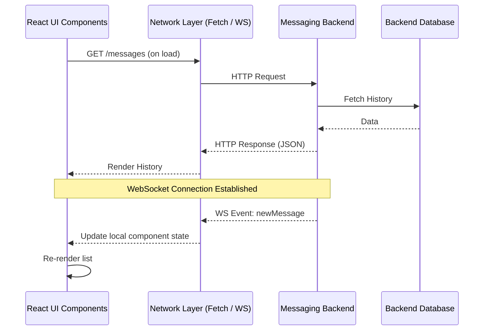

**State lifecycle:**

```
[ Page Load ] ──> [ Fetch History (REST) ] ──> [ React Local State ] ──> [ UI Render ]
                                                        ▲
[ Network Disconnect ] ──> [ State Wiped ] ──> [ WebSocket Event (Reconnect) ] ──┘
```

### ⚖️ Detailed Pros & Cons

| Category    | Details                                                                                                                                                                                                                                                                                                                                                                                                                                                                                                                                                                                                                                                                                                                                                                                   |
| :---------- | :---------------------------------------------------------------------------------------------------------------------------------------------------------------------------------------------------------------------------------------------------------------------------------------------------------------------------------------------------------------------------------------------------------------------------------------------------------------------------------------------------------------------------------------------------------------------------------------------------------------------------------------------------------------------------------------------------------------------------------------------------------------------------------------- |
| ✅ **Pros** | • **Minimal Boilerplate:** No store setup, no reducers, no normalization libraries. Fastest path to "something on screen."<br>• **Easy to Understand:** Data flows linearly from API → state → UI. No indirection layers.<br>• **Zero Learning Curve:** Uses only React fundamentals. No third-party state libraries to learn.                                                                                                                                                                                                                                                                                                                                                                                                                                                            |
| ❌ **Cons** | • **Full Round-Trip Latency:** Nothing renders until the REST call completes. Chat history feels sluggish on slow networks.<br>• **Total State Loss on Refresh:** Page reload wipes all context. User loses scroll position, draft messages, and unread markers.<br>• **Prop Drilling Hell:** Nested components need message/user data passed through 5+ parent levels. Refactoring is painful.<br>• **Duplicate Data Everywhere:** Same user object stored in multiple component states. Updating avatar requires finding every instance.<br>• **No Optimistic UI:** Messages appear only after server confirms. Feels unresponsive compared to native apps.<br>• **Phase 2 Fragility:** WebRTC signaling errors compound with already-fragile chat state. Call UI will feel unreliable. |

### Complexity Assessment

**Low.** Suitable only for prototypes or demos. Not recommended for any serious chat application.

---

## Client Approach 2: The Thick Client (In-Memory SPA)

### 📘 Background & Tech Stack Basics

The industry-standard approach for SPAs. A global store (Zustand/Redux) holds normalized entities by ID. Components subscribe to slices of state rather than receiving props. Optimistic updates make the UI feel instant while the server catches up asynchronously.

- **State Management:** Zustand (recommended for simplicity) or Redux Toolkit. Both support normalized state patterns.
- **Normalization:** Store shape uses flat dictionaries (`{ [id]: entity }`) rather than nested arrays. Libraries like `normalizr` automate this, but manual normalization teaches the concept better.
- **Server State Cache:** TanStack Query (React Query) for REST endpoints. Handles caching, background refetching, and stale-while-revalidate separately from socket state.
- **Optimistic Updates:** On send, immediately add message to store with `status: 'sending'`. On ACK, swap temp ID for real ID. On error, revert or mark failed.

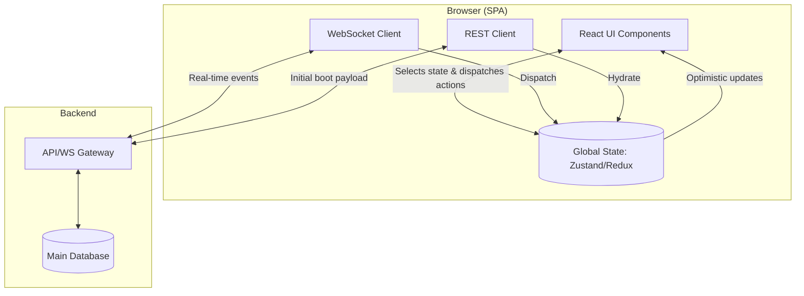

**Normalized store shape:**

| Store slice     | Schema (normalized by ID)                                                                                               |
| --------------- | ----------------------------------------------------------------------------------------------------------------------- |
| `users`         | `{ "u1": { name: "Alice", status: "online" }, "u2": { name: "Bob", status: "offline" } }`                               |
| `conversations` | `{ "c1": { participantIds: ["u1","u2"], messages: ["m1","m2"] } }`                                                      |
| `messages`      | `{ "m1": { senderId: "u1", body: "Hey", status: "sent" }, "m2": { senderId: "u2", body: "Hello", status: "sending" } }` |

**Useful mental model:** Split your store into three distinct categories — **Server State** (user profiles, group metadata — things fetched from and reconciled with the backend), **Socket State** (who's currently connected, live typing/presence — inherently transient), and **Local UI State** (draft messages, which chat is open, scroll position — never leaves the browser). Keeping these separate early avoids a common mess where transient socket noise triggers the same re-render/reconciliation logic as durable data.

### ⚖️ Detailed Pros & Cons

| Category    | Details                                                                                                                                                                                                                                                                                                                                                                                                                                                                                                                                                                                                                                                                                               |
| :---------- | :---------------------------------------------------------------------------------------------------------------------------------------------------------------------------------------------------------------------------------------------------------------------------------------------------------------------------------------------------------------------------------------------------------------------------------------------------------------------------------------------------------------------------------------------------------------------------------------------------------------------------------------------------------------------------------------------------- |
| ✅ **Pros** | • **Instant Interactions:** Optimistic UI makes sends feel synchronous even on high-latency networks.<br>• **Normalized Updates:** Change a user's name in one place; every message, member list, and profile card updates automatically.<br>• **Clear State Boundaries:** Separating Server State / Socket State / Local UI State prevents transient socket noise from triggering unnecessary re-renders.<br>• **Phase 2 Natural Fit:** Call state (ringing, muted, connected) fits cleanly into the Socket State category alongside typing indicators.<br>• **Industry Standard Pattern:** Skills transfer directly to professional React roles. Most mid-to-large companies use this architecture. |
| ❌ **Cons** | • **Boot Payload Problem:** Initial load fetches all conversations + recent messages. As history grows, startup time degrades linearly.<br>• **Memory Growth:** Entire active session lives in RAM. Long-running tabs with thousands of messages can cause GC pauses.<br>• **No Offline Resilience:** Disconnect = frozen UI. Reconnect requires full re-fetch of missed events.<br>• **Store Design Discipline Required:** Mixing server/socket/UI state creates subtle bugs. Must enforce boundaries rigorously.<br>• **Reconciliation Complexity:** Optimistic updates that conflict with server state (e.g., edited message arrived before ACK) require careful merge logic.                      |

### Complexity Assessment

**Medium.** The right balance of power and learnability for Phase 1. Recommended starting point.

---

## Client Approach 3: The Offline-First Client (Local DB Sync)

### 📘 Background & Tech Stack Basics

Elevates the browser's local database (IndexedDB) from cache to **primary source of truth**. The UI reads exclusively from IndexedDB; the network layer becomes a background sync engine. This eliminates boot-payload latency entirely and provides true offline resilience.

- **Local Database:** Dexie.js (IndexedDB wrapper). Provides Promise-based API, indexes, and transactions over raw IndexedDB's verbose interface.
- **Sync Engine:** Custom queue scheduler that processes outbound writes when online and retries with exponential backoff when offline.
- **Hydration Strategy:** On app load, render immediately from IndexedDB. Background sync fetches deltas (new messages since last sync timestamp) and merges into local DB.
- **Conflict Resolution:** Last-write-wins based on server timestamps for messages. Explicit merge strategies for editable entities (group names, profiles).

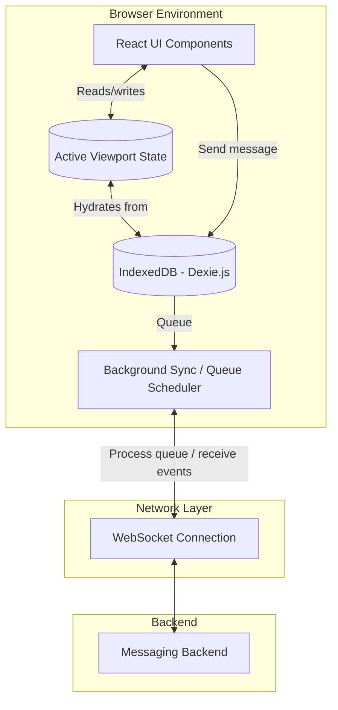

**Outbound sync queue (state machine):**

```
[ Message Drafted (UI) ] ─(write to IndexedDB)─> [ Status: pending ]
                                                        │
                                          (network available?)
                                     No ──────────────┐   Yes
                                     ▼                 ▼
                          [ Scheduler Paused ]   [ Send via WebSocket ]
                                                        │
                                              (server acknowledged?)
                                     No ──────────────┐   Yes
                                     ▼                 ▼
                       [ Retry with backoff ]   [ Status: delivered ]
```

### ⚖️ Detailed Pros & Cons

| Category    | Details                                                                                                                                                                                                                                                                                                                                                                                                                                                                                                                                                                                                                                                                                                                                                           |
| :---------- | :---------------------------------------------------------------------------------------------------------------------------------------------------------------------------------------------------------------------------------------------------------------------------------------------------------------------------------------------------------------------------------------------------------------------------------------------------------------------------------------------------------------------------------------------------------------------------------------------------------------------------------------------------------------------------------------------------------------------------------------------------------------- |
| ✅ **Pros** | • **Instant Boot:** UI renders in <100ms regardless of history size. IndexedDB reads are synchronous-feeling.<br>• **True Offline Support:** Users can read history, compose messages, and navigate while disconnected. Queue syncs when back online.<br>• **Eliminates Boot Payload:** No massive initial fetch. Only deltas sync in background.<br>• **Phase 2 Performance Win:** Offloading chat state to IndexedDB frees main thread for WebRTC encoding/decoding. Critical for smooth video calls.<br>• **Resilient to Network Flakiness:** Elevator WiFi drops, subway commutes, spotty mobile networks—all handled gracefully without UX degradation.                                                                                                      |
| ❌ **Cons** | • **Sync Engine Complexity:** Writing a correct, idempotent, retry-safe sync queue is non-trivial. Edge cases (duplicate sends, out-of-order ACKs) require thorough testing.<br>• **IndexedDB Quirks:** Browser storage limits (~600MB typical), no cross-tab sync without BroadcastChannel API, Safari private mode restrictions.<br>• **Debugging Opacity:** Can't inspect IndexedDB state in React DevTools. Must use browser Application tab or custom dev panels.<br>• **Schema Migration Pain:** IndexedDB version upgrades are irreversible and error-prone. Unlike SQL migrations, there's no rollback.<br>• **Overkill for Simple Apps:** If users are always online and history is small, the sync engine adds complexity without proportional benefit. |

### Complexity Assessment

**Medium-High.** Highest ROI next step after Approach 2. Directly solves boot-payload and Phase 2 performance issues.

---

## Client Approach 4: Web Worker–Driven (Off-Main-Thread)

### 📘 Background & Tech Stack Basics

JavaScript is single-threaded. Parsing a 10,000-message WebSocket payload, querying IndexedDB, and rendering React all compete for the same thread—causing dropped frames and janky scrolling. Web Workers move all non-UI work to a background thread, leaving the main thread dedicated solely to rendering at 60fps.

- **Worker Communication:** `postMessage()` API. Structured clone algorithm serializes data between threads. Large payloads can use `Transferable Objects` (ArrayBuffers) for zero-copy transfer.
- **Worker Types:** Dedicated Worker (one per tab) or SharedWorker (shared across tabs from same origin). SharedWorker reduces memory but adds lifecycle complexity.
- **In-Worker Storage:** IndexedDB or SQLite-WASM. Worker owns the DB connection; main thread never touches storage directly.
- **Bridge Pattern:** Main thread exposes a typed RPC-like interface over `postMessage`. Worker responds with results. Libraries like `comlink` abstract this into async function calls.

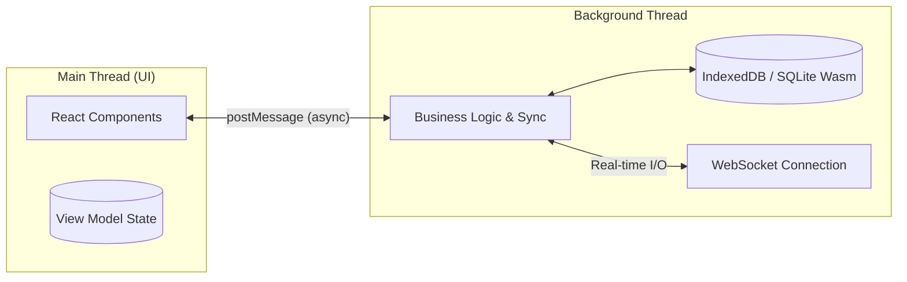

**Thread distribution:**

```
MAIN THREAD (UI)   ──[Render UI]───[User Scroll]───[Animate Call UI]──── (smooth 60fps)
                            ▲               ▲
                   (async postMessage)  (async postMessage)
                            ▼               ▼
WEB WORKER THREAD   ──[Parse JSON (1MB)]──[Write to DB]──[Network polling]── (background)
```

### ⚖️ Detailed Pros & Cons

| Category    | Details                                                                                                                                                                                                                                                                                                                                                                                                                                                                                                                                                                                                                                                                                                                                                                                                                                                                                                |
| :---------- | :----------------------------------------------------------------------------------------------------------------------------------------------------------------------------------------------------------------------------------------------------------------------------------------------------------------------------------------------------------------------------------------------------------------------------------------------------------------------------------------------------------------------------------------------------------------------------------------------------------------------------------------------------------------------------------------------------------------------------------------------------------------------------------------------------------------------------------------------------------------------------------------------------- |
| ✅ **Pros** | • **Butter-Smooth UI:** Main thread never blocks. Scrolling, animations, and call UI remain responsive under heavy load.<br>• **Parallel Processing:** JSON parsing, DB queries, and crypto operations happen concurrently with rendering.<br>• **Scales to Desktop-App Loads:** Discord/Telegram Web use this exact pattern to handle millions of messages without freezing.<br>• **Phase 2 Raw Performance:** WebRTC encoding is CPU-intensive. Keeping it on main thread while chat parsing runs in worker prevents frame drops during calls.                                                                                                                                                                                                                                                                                                                                                       |
| ❌ **Cons** | • **Async Bridge Overhead:** Every interaction crosses a serialization boundary. Small, frequent updates (typing indicators) can incur more overhead than doing them on main thread.<br>• **Debugging Difficulty:** Workers have separate DevTools contexts. Breakpoints, console logs, and network tabs are isolated.<br>• **State Synchronization:** Main thread view model can drift from worker state. Need explicit sync protocol for UI-relevant state changes.<br>• **Phase 2 Signaling Complexity:** WebRTC SDP/ICE events must cross the postMessage bridge. Timing-sensitive negotiation can fail if bridge latency spikes.<br>• **Browser Support Gaps:** SharedWorker unsupported in Safari. Fallback to Dedicated Worker doubles memory usage per tab.<br>• **Testing Complexity:** Unit testing workers requires special harnesses. Integration tests must simulate multi-thread timing. |

### Complexity Assessment

**High.** Valuable deep-dive exercise after mastering Approaches 2-3. Overkill for initial build.

---

## Client Approach 5: Local-First Architecture with CRDTs

### 📘 Background & Tech Stack Basics

The most advanced paradigm. Instead of the server being the canonical source of truth, each client holds a full local replica. Conflict-Free Replicated Data Types (CRDTs) guarantee that concurrent edits merge deterministically without central coordination. The server becomes a sync peer, not an authority.

- **CRDT Libraries:** Yjs (most mature ecosystem), Automerge (stronger theoretical guarantees), or Diamond-types (performance-focused).
- **Local Storage:** SQLite-WASM or IndexedDB backing the CRDT document.
- **Sync Protocol:** y-websocket, y-webrtc, or custom relay server. Syncs CRDT state vectors, not raw data.
- **Conflict Semantics:** Last-Writer-Wins (LWW) for simple fields. Multi-value registers or OR-sets for collaborative lists. No manual conflict resolution code needed.

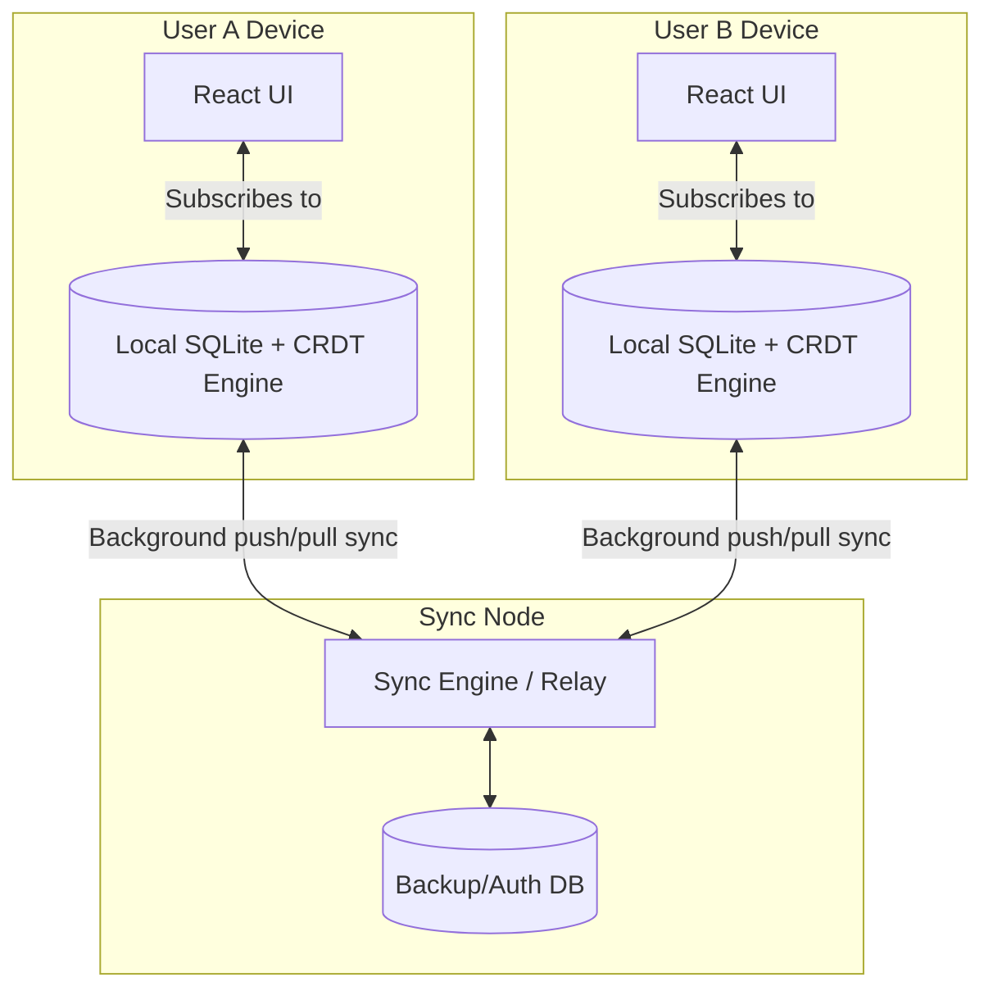

**Conflict resolution example (Last-Write-Wins):**

```
User A edits group title to "Group Alpha" at t=10.01   ─┐
                                                          ├──> Deterministically merged
User B edits group title to "Group Beta"  at t=10.02   ─┘     Result on both devices: "Group Beta"
```

### ⚖️ Detailed Pros & Cons

| Category    | Details                                                                                                                                                                                                                                                                                                                                                                                                                                                                                                                                                                                                                                                                                                                                                                                                                                         |
| :---------- | :---------------------------------------------------------------------------------------------------------------------------------------------------------------------------------------------------------------------------------------------------------------------------------------------------------------------------------------------------------------------------------------------------------------------------------------------------------------------------------------------------------------------------------------------------------------------------------------------------------------------------------------------------------------------------------------------------------------------------------------------------------------------------------------------------------------------------------------------- |
| ✅ **Pros** | • **True Zero-Latency UI:** Every read/write is local. Network is invisible to UX.<br>• **Deterministic Convergence:** Mathematically guaranteed consistent state across all replicas, even after extended offline periods.<br>• **Elegant Phase 2 Integration:** WebRTC SDP offers are just CRDT data. Signaling _is_ sync—no separate protocol needed.<br>• **Collaboration-Ready:** Group editing, shared notes, and real-time cursors come free with the CRDT infrastructure.<br>• **Maximum Resilience:** Works fully offline indefinitely. Syncs when any peer comes online, even without central server.                                                                                                                                                                                                                                 |
| ❌ **Cons** | • **Paradigm Shift:** Thinking in CRDTs is fundamentally different from CRUD. Steep learning curve for developers accustomed to REST/GraphQL.<br>• **Bundle Size:** Yjs + SQLite-WASM adds 200-500KB gzipped. Significant for mobile-first users.<br>• **Tombstone Accumulation:** Deleted items leave metadata tombstones for convergence. Long-lived documents grow unbounded without garbage collection.<br>• **Limited Query Capability:** CRDTs are optimized for sync, not complex queries. Need secondary indexes or materialized views for filtered searches.<br>• **Ecosystem Immaturity:** Fewer tutorials, debugging tools, and production case studies than traditional architectures.<br>• **Server Still Needed:** For auth, backup, and cross-device sync. "Local-first" ≠ "serverless." Just different server responsibilities. |

### Complexity Assessment

**Highest.** Research-grade architecture. Worth studying, but not recommended for Phase 1 unless CRDTs are the explicit learning goal.

---

## Frontend Comparison Matrix

|                                  | Complexity  | Initial Load Time            | Offline Resilience                                  | Phase 2 (Calls) Fit                             |
| -------------------------------- | ----------- | ---------------------------- | --------------------------------------------------- | ----------------------------------------------- |
| **1. Thin Client**               | Low         | Slow (waits on network)      | None — state wiped on refresh                       | Cheap to add, but fragile UX                    |
| **2. Thick Client (SPA)**        | Medium      | Degrades with history size   | None beyond in-memory session                       | Clean home for call state                       |
| **3. Offline-First (IndexedDB)** | Medium-High | Instant (local-first render) | Strong — queued sync with backoff                   | Frees main thread for WebRTC encoding           |
| **4. Web Worker–Driven**         | High        | Instant, and never blocks UI | Strong (worker owns local DB)                       | Best raw performance, most signaling complexity |
| **5. Local-First (CRDTs)**       | Highest     | Instant                      | Strongest — true offline-first, deterministic merge | Most elegant (signaling _is_ data sync)         |

---

## Cross-Cutting Frontend Concerns

These practices apply **regardless** of which client approach you choose:

### 1. DOM Virtualization + Memoization

Use `react-virtuoso` or `react-window` to render only visible messages. Pair with `React.memo` so new messages don't re-render the entire list. Virtualization controls _what's mounted_; memoization controls _what re-renders_. You need both.

### 2. Thundering Herd Prevention

On reconnect, use exponential backoff with jitter. Fetch only metadata first (unread counts, conversation list); lazy-load message history on scroll. Never re-fetch everything missed in one shot. This pairs particularly well with **Client Approach 3 (Offline-First)** — you already have a sync queue and backoff logic for outbound messages there, so extending the same pattern to inbound reconnection sync is a natural addition.

### 3. Performance Monitoring

Run Playwright synthetic tests in GitHub Actions (free). Measure load time, virtualized-list mount time, and WS-to-render latency. Log to CloudWatch Logs Insights (pay-per-query, near-$0). Treat perf regressions like failing tests.

### 4. Static Hosting

Serve built SPA from S3 + CloudFront (1TB/month free transfer). Keeps compute layer pure for API/WebSocket traffic. Free TLS via ACM.

---

# Part 3: Advanced Architecture — Critical Missing Pieces

> These components aren't alternatives to the approaches above — they're **cross-cutting concerns** that apply to any backend/frontend combination and become critical as your app grows past toy scale.

## 1. The Presence System (The Hidden Bottleneck)

**The Issue:** Naive broadcasting of presence updates (online/offline/typing) to all active sockets creates an O(N²) problem.

**The Solution:** Implement a **Presence Service** backed by Redis/DynamoDB with TTL:

- Clients send "heartbeat" packets every 15–30 seconds.
- Service updates `last_seen` timestamps.
- **Throttled Presence:** Only broadcast status changes to users _currently viewing_ that specific channel, not the entire group.

**Why it Matters:** Prevents broadcast explosion (e.g., sending "User X offline" to 4,999 users in a 5,000-member group when one person closes their laptop).

## 2. Distributed Tracing & Request IDs

**The Issue:** Logs are useless in distributed/async systems without the ability to stitch them together.

**The Solution:** Architect for **Correlation IDs**:

- Inject a `traceId` at the Gateway/Edge for every request (REST or WS).
- Pass this ID to the Pub/Sub broker and log it via the Persistence Worker.

**Why it Matters:** Enables precise debugging. If a message vanishes, you can grep logs (CloudWatch/ELK) using the `traceId` to pinpoint exactly which service dropped it.

## 3. Client-Side Media Processing

**The Issue:** Uploading raw, high-res media (e.g., 10MB phone photos) wastes bandwidth and storage.

**The Solution:** **Client-Side Transcoding** — perform canvas resizing/compression on the browser thread _before_ upload.

**Why it Matters:**

- **Cost:** Reduces S3 storage costs.
- **Latency:** Saves sender bandwidth.
- **Compute:** Eliminates the need for a backend "Thumbnail Generator" microservice.

## 4. The "Re-sync" Protocol (Delta Updates)

**The Issue:** Fetching "the last 50 messages" on WebSocket reconnection risks data loss or duplication.

**The Solution:** **Sync/Sequence Token Architecture**:

- Assign every message an incrementing sequence number (`seq_id`) or high-res timestamp.
- On reconnect, client sends `last_seen_seq_id`. Backend queries: `SELECT * WHERE seq_id > last_seen_seq_id`.

**Why it Matters:** Guarantees zero data gaps or duplicates, even after extended network outages.

## 5. API Gateway / WebSocket Injection Prevention

**The Issue:** Serverless approaches relying on API Gateway route selection based on JSON payloads are vulnerable to malformed data.

**The Solution:** **Rigid Schema Validation** — implement strict JSON Schema validation before routing.

**Why it Matters:** Prevents malicious or malformed JSON from crashing the `SendMessageLambda`, avoiding inflated invocation costs and self-inflicted DoS.

### Summary of Advanced Components

| Component      | Strategy               | Why?                                                       |
| :------------- | :--------------------- | :--------------------------------------------------------- |
| **Presence**   | Heartbeat + Windowing  | Avoids O(N²) broadcast explosion in large groups           |
| **Tracing**    | Trace-ID Propagation   | Critical for debugging "vanished messages" in async stacks |
| **Media**      | Client-Side Resizing   | Eliminates the need for "Thumbnailer" microservices        |
| **Sync**       | Sequence Tokening      | Guarantees no data loss during network flapping            |
| **Validation** | JSON Schema Validation | Prevents malformed WS payloads from crashing Lambdas       |

---

# Recommendation

**Backend:** Build **Approach 1** (Monolith) first end-to-end. Once it works, evolve deliberately into **Approach 3** (Hybrid) — that migration is itself a great mini-project that teaches sync/async boundary design. Treat **Approach 2** (Serverless) and **Approach 4** (Microservices) as separate follow-up builds once you have a working baseline to compare against.

**Frontend:** Pair your backend monolith with **Client Approach 2** (Thick Client / normalized global store) first — it's the natural match for a Socket.IO backend and teaches you the state-modeling skills every later approach builds on. Once that's solid, **Client Approach 3** (Offline-First with IndexedDB) is the highest-value next step: it directly fixes the boot-payload problem and sets you up well for Phase 2 call performance. Treat **Client Approach 4** (Web Worker) and **Client Approach 5** (CRDTs) as deliberate deep-dive exercises afterward — genuinely valuable to learn, but overkill to start with for a project at your current scale.

**Final Verdict:** The monolith-to-hybrid evolution plan is highly realistic. Building **Approach 1 (Monolith)** and subsequently refactoring to **Approach 3 (Hybrid)** will provide deeper system design insights than 90% of engineers typically acquire.


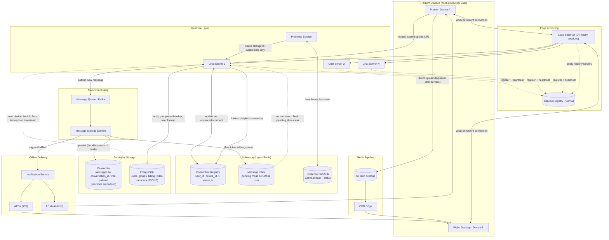
